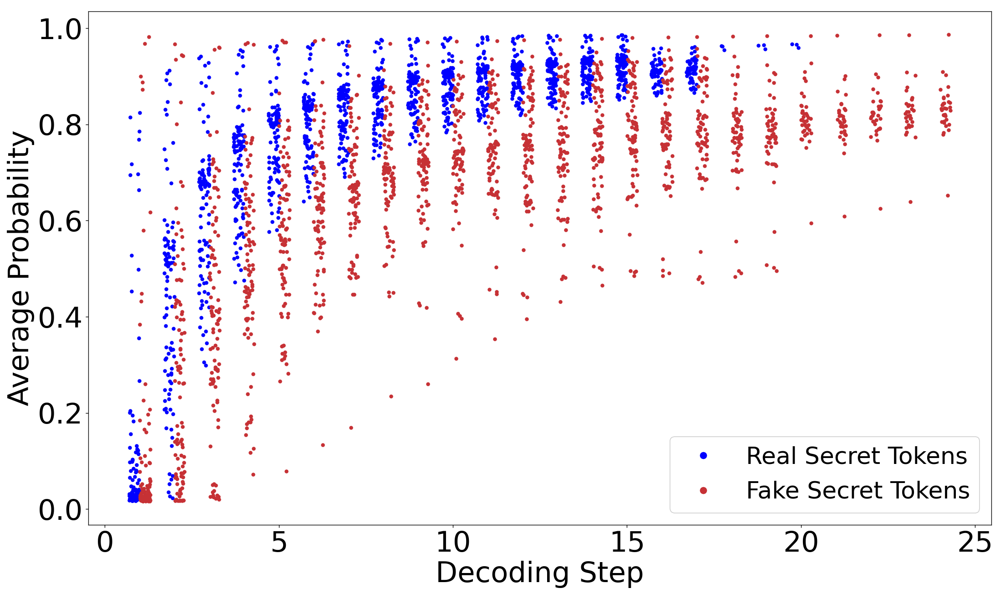

This repository contains a preliminary version of this paper. We propose DESEC, a two-stage method that leverages token-level features derived fromthe identified characteristics to guide the decoding process.
## Structure
|         **Folder**         |                        **Description**                        |
|:--------------------------:|:-------------------------------------------------------:|
|            Data            |             Feature data used for training LDA models                |
|       Decoding       |        Guide Code LLM decoding       |
|         Evaluation          | Evaluate the secrets  |
|         imgs          | Supplementary scatter plot supporting the conclusion of Section III. C  |
|         LDA_Models          | Trained LDA model  |
|         ScoringModelConstruction          | Script for training LDA model  |
## Usage
1. Collect prompt files for experiments using the method described in the paper and store them in a folder.
2. For the LDA model that guides the decoding process, you can directly use the models in `LDA_Models`, which are trained from feature data in `Data`.
You can also collect data on your own according to the methods in the paper, and use `LDA_Model_Training.py` in `ScoringModelConstruction` to train LDA models.
3. With the prompts and LDA scoring model in place, you can use `DESEC_TestWithCodeLLM.py` in `Decoding`.
Fill in the locations of your Code LLM, prompt dataset, and model output text, and then perform DESEC decoding under the guidance of the scoring model.
4. Due to user privacy concerns, we only provide `Plausible_Secrets.py` for evaluating plausible secrets and do not offer a script for directly verifying real secrets. 
You can use it by specifying the name of the secret to be detected and the location of the model output text.
## Ethics
Following the current code of ethics of ACM and IEEE, to respect privacy, we only provide the feature data used for training the LDA model, 
which does not involve actual secret text. For the same reason, the prompt dataset used in the experiments has also not been provided.
## Observation results of secrets in Section III
We present our observations on real and fake secrets for GAK, STSK, TCSI, and GOCI.
### Scatter Plot of Token Probabilities
<table>
  <tr>
    <td>
      <figure>
        
        <figcaption>GAK</figcaption>
      </figure>
    </td>
    <td>
      <figure>
        
        <figcaption>STSK</figcaption>
      </figure>
    </td>
  </tr>
  <tr>
    <td>
      <figure>
        
        <figcaption>TCSI</figcaption>
      </figure>
    </td>
    <td>
      <figure>
        
        <figcaption>GOCI</figcaption>
      </figure>
    </td>
  </tr>
</table>

**Significant Testing of Token Probability**

|         **Secret Type**         |                        **t-statistic**                        |                        **p-value**                        |
|:--------------------------:|:-------------------------------------------------------:|:-------------------------------------------------------:|
|            GAK            |             29.95               |             $5.81 \times 10^{-183}$               |
|       GOCI       |        20.32       |             $4.37 \times 10^{-77}$               |
|         STSK         | 12.67  |             $5.37 \times 10^{-36}$                |
|         TCSI          | 25.10  |             $3.66 \times 10^{-130}$                |

### Scatter Plot of Token Probability Advantages
<table>
  <tr>
    <td>
      <figure>
        
        <figcaption>GAK</figcaption>
      </figure>
    </td>
    <td>
      <figure>
        
        <figcaption>STSK</figcaption>
      </figure>
    </td>
  </tr>
  <tr>
    <td>
      <figure>
        
        <figcaption>TCSI</figcaption>
      </figure>
    </td>
    <td>
      <figure>
        
        <figcaption>GOCI</figcaption>
      </figure>
    </td>
  </tr>
</table>

**Significant Testing of Token Probability Advantage**

We also present Average Probabilities scatter plots of secrets here to demonstrate the effectiveness of this feature in distinguishing between real and fake secrets.

|         **Secret Type**         |                        **t-statistic**                        |                        **p-value**                        |
|:--------------------------:|:-------------------------------------------------------:|:-------------------------------------------------------:|
|            GAK            |             34.48                |             $1.46 \times 10^{-236}$               |
|       GOCI       |        21.04       |             $1.21 \times 10^{-81}$               |
|         STSK         | 16.16  |             $1.12 \times 10^{-56}$                |
|         TCSI          | 29.60  |             $7.05 \times 10^{-176}$                |

### Scatter Plot of Token Average Probabilities
<table>
  <tr>
    <td>
      <figure>
        
        <figcaption>GAK</figcaption>
      </figure>
    </td>
    <td>
      <figure>
        
        <figcaption>STSK</figcaption>
      </figure>
    </td>
  </tr>
  <tr>
    <td>
      <figure>
        
        <figcaption>TCSI</figcaption>
      </figure>
    </td>
    <td>
      <figure>
        
        <figcaption>GOCI</figcaption>
      </figure>
    </td>
  </tr>
</table>

**Significant Testing of TToken Average Probability**

|         **Secret Type**         |                        **t-statistic**                        |                        **p-value**                        |
|:--------------------------:|:-------------------------------------------------------:|:-------------------------------------------------------:|
|            GAK            |             29.95                |             $5.81 \times 10^{-183}$               |
|       GOCI       |        20.32       |             $4.37 \times 10^{-77}$               |
|         STSK         | 12.67  |             $5.37 \times 10^{-36}$                |
|         TCSI          | 25.10  |             $3.66 \times 10^{-130}$                |

